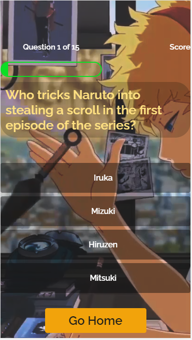

# Naruto Quiz Application

## Teksystems Javascript SBA

The **Naruto Quiz** application is designed and built by a Naruto enthusiast for the naruto enthusiast. Challenge yourself with 15 increasingly difficult questions that will test your knowledge of all things in the Naruto Anime world.
  
    
      

### HOW TO PLAY
1. While on the landing page press the start quiz button to begin the quiz.

2. If you wish to view all of the available pages of the application, press the fishcake icon  to open the side menu.

3. While taking the quiz, select your answer from 1 of 4 possible solutions.

4. If you get a question wrong (on pc) you the answer you selected will be highlighted in red and a message will appear that explains the solution to the question. 

5. Your score and question number are tracked at the top of the quiz hub.

6. Once you have completed the quiz you will be taken to a page where you can choose to save your score in localStorage, retake the quiz, or go back to the landing page.

7. View the Top 5 scores at the end of the quiz and see if you made the cut.
  
### Screen Shots:

### Technologies Used:

## MVP
- As a user I should be able to see a video background play on the landing/quiz/end of quiz/ and high score pages

- As a user, I should be able to select only one answer per a question.

- As a user, I should see a description of the answer if I get the quesiton wrong.

- As a user I should be able to go back to the landing page at any point of the quiz.

- As a user I should be able to view the top 5 highest scores in localStorage memory

- As a user, I should be able to enter my email address to register for the high score list.